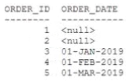
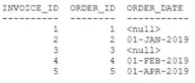
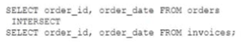

# Question 83
Examine the data in the ORDERS table:

		
Examine the data in the INVOICES table:

		
Examine this query:

		

# Answers
A.2

B.1

C.3

D.5 01-MAR-2019

E.3 01-JAN-2015

F.4 01-FEB-2015

# Discussions
## Discussion 1
drop table orders;
create table orders(order_id number , order_date date);

insert into orders values(1,null);
insert into orders values(2,null);
insert into orders values(3,'1-jan-2019');
insert into orders values(4,'1-feb-2019');
insert into orders values(5,'1-mar-2019');

create table invoices(
invoice_id number, order_id number, order_date date);

insert into invoices values(1,1,null);
insert into invoices values(2,2,'01-jan-2019');
insert into invoices values(3,3,null);
insert into invoices values(4,4,'01-feb-2019');
insert into invoices values(5,5,'01-APR-2019');

SELECT ORDER_ID , ORDER_DATE FROM ORDERS
INTERSECT
SELECT ORDER_ID , ORDER_DATE FROM INVOICES;

ANSWER IS B,F.

## Discussion 2
This needs an update badly. There is no question, just some tables and a query showing on this site..

## Discussion 3
bf only if  F is  01-FEB-2019 and not 01-FEB-2015

## Discussion 4
Tesded:
1 null
4 01/02/19 00:00:00

## Discussion 5
bf only if F is 01-FEB-2019 and not 01-FEB-2015 i am sorry then is B only

