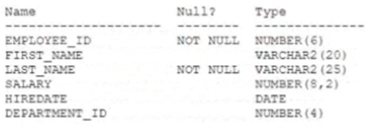

# Question 90
Examine the description of the EMPLOYEES table:

		
Which two statements will insert a row into the EMPLOYEES table? (Choose two.)

# Answers
A.INSERT INTO employees VALUES (101, 'John', 'Smith', 12000, SYSDATE);

B.INSERT INTO employees VALUES (101, 'John', 'Smith', 10, 12000, SYSDATE);

C.INSERT INTO employees (employee_id, salary, first_name, hiredate, last_name) VALUES (101, 12100, 'John', SYSDATE, 'Smith');

D.INSERT INTO employees (employee_id, first_name, last_name, salary, hiresate)VALUES ( (SELECT 101, 'John', 'Smith'. 12000, SYSDATE FROM dual) );

E.INSERT INTO employees SELECT 101, 'John', 'Smith', 12000, (SELECT SYSDATE FROM dual), 10 FROM dual;

F.INSERT INTO employees VALUES (101, 'John', ' ', 12000, SYSDATE, 10);

# Discussions
## Discussion 1
i am finding 3 that are correct. CEF

## Discussion 2
I think it’s CE ?

## Discussion 3
F is wrong
because the column last_name has a not null constraint, in this case Oracle will not accept '' as value for the last_name column

CE is the correct answer

## Discussion 4
CF is correct. 
in F, if have space between ' ' for last Name, it will be accepted. if there is no space, then not null constraint will apply.

## Discussion 5
CEF are corret. I checked in data base.

