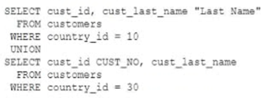

# Question 93
Examine this statement:

		
Identify three ORDER BY clauses, any one of which will complete the query successfully. (Choose three.)

# Answers
A.ORDER BY CUST_NO

B.ORDER BY 2, cust_id

C.ORDER BY 2, 1

D.ORDER BY "Last Name"

E.ORDER BY "CUST_NO"

# Discussions
## Discussion 1
You can only order by column names from the first select query

## Discussion 2
Correct answer is BCD.
The ORDER BY clause does not recognize the column names of the second SELECT query. So,

## Discussion 3
A & E doesn't work because

he ORDER BY clause needs to refer to something that exists in both parts of the union (either a column position or an alias that applies to both parts).

