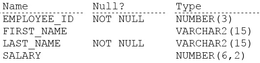

# Question 95
Examine the description of the EMPLOYEES table:

		
Which two statements will run successfully? (Choose two.)

# Answers
A.SELECT ‘The first_name is ‘‘ || first_name || ‘‘ FROM employees;

B.SELECT ‘The first_name is ‘‘‘ || first_name || ‘‘‘‘ FROM employees;

C.SELECT ‘The first_name is ‘‘‘ || first_name || ‘‘‘ FROM employees;

D.SELECT ‘The first_name is ‘ || first_name || ‘‘ FROM employees;

E.SELECT ‘The first_name is \‘‘ || first_name || ‘\‘‘ FROM employees;

# Discussions
## Discussion 1
Can someone explain why B,D is correct ?

## Discussion 2
BD is the correct answer

## Discussion 3
Who chose the correct answer?

## Discussion 4
I tried... none works.... anybody can explain even just a bit?

## Discussion 5
BD are correct

