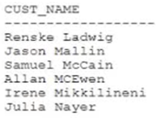

# Question 97
Examine the data in the CUST_NAME column of the CUSTOMERS table:

		
You want to display the CUST_NAME values where the last name starts with Mc or MC.
Which two WHERE clauses give the required result? (Choose two.)

# Answers
A.WHERE INITCAP(SUBSTR(cust_name, INSTR(cust_name, ' ') + 1)) LIKE 'Mc%'

B.WHERE SUBSTR(cust_name, INSTR(cust_name, ' ') + 1) LIKE 'Mc%'

C.WHERE SUBSTR(cust_name, INSTR(cust_name, ' ') + 1 ) LIKE 'Mc%' OR 'MC%'

D.WHERE UPPER(SUBSTR(cust_name, INSTR(cust_name, ' ') + 1)) LIKE UPPER('MC%')

E.WHERE INITCAP(SUBSTR(cust_name, INSTR(cust_name, ' ’) + 1)) IN ('MC%', 'Mc%)

# Discussions
## Discussion 1
Tried all, AD are correct.
B is incorrect as it only returns McCain and not MCEwan due to Mc and MC mismatch.

## Discussion 2
AD is the correct answer

## Discussion 3
AD are correct

## Discussion 4
AD tested 100% guarantee

## Discussion 5
AD is the answer

